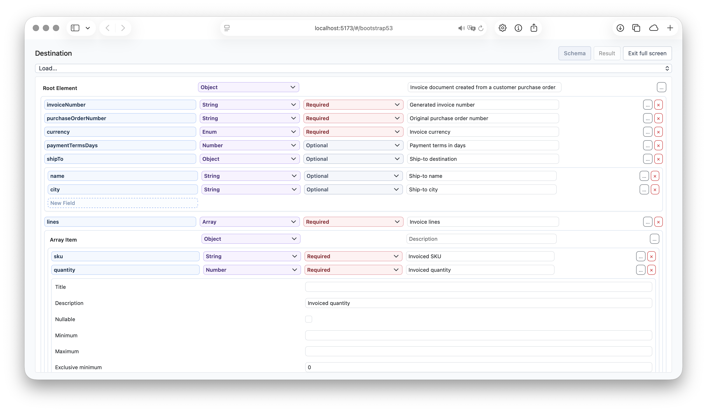

# React JSON Schema Editor

## Overview

`morphos/react-schema-editor` is a lightweight, customizable React JSON Schema editor for applications where users
need to create or maintain schemas visually.

The editor manages JSON Schema state and editing behavior without imposing a page layout or component library. Its
default UI is plain HTML, every structural part can be replaced through the `components` prop, and optional Bootstrap
3.4 and 5.3 component sets are available when those styles already fit your application.

Use it to:

- build source and destination schemas for data mapping, imports, exports, and API payloads;
- embed schema editing in an existing form, settings page, drawer, or modal workflow;
- keep the schema controlled in React and receive the complete JSON Schema after each change;
- replace individual controls or the complete nested-property layout with application-owned components.


[](https://morphosjs.org/playground/#/bootstrap53)

Try the schema editor in the source and destination panels of the
[interactive playground](https://morphosjs.org/playground/#/bootstrap53).

## Installation

React is an optional peer dependency of `morphos`:

```bash
npm install morphos react react-dom
```

Importing `morphos/react-schema-editor` does not require Bootstrap or another UI framework.

## Quick Start

```tsx
import { useState } from 'react';
import { SchemaEditor, type JsonSchema } from 'morphos/react-schema-editor';

const initialSchema: JsonSchema = {
	type: 'object',
	properties: {
		invoiceNumber: { type: 'string' },
		totalAmount: { type: 'number' },
		billTo: {
			type: 'object',
			properties: {
				name: { type: 'string' }
			}
		}
	},
	required: ['invoiceNumber']
};

function InvoiceSchemaEditor() {
	const [schema, setSchema] = useState<JsonSchema>(initialSchema);

	return <SchemaEditor value={schema} onChange={setSchema} />;
}
```

`onChange` receives the complete current schema, so the same state can drive validation, previews, persistence, or a
[`MappingEditor`](https://morphosjs.org/react/).

For an uncontrolled editor, pass `defaultValue` instead. The current value remains available through the editor ref.

## Customize the Layout

The editor is intentionally headless at its structural boundaries. It supplies ready-to-render controls and nested
content, while your components decide where and how they appear.

For example, replace the default inline nested-properties section with your application's dialog components:

```tsx
import type { SectionProps } from 'morphos/react-schema-editor';
import { Dialog, DialogContent, DialogTrigger } from './ui/Dialog';

function NestedPropertiesDialog({ children }: SectionProps) {
	return (
		<Dialog>
			<DialogTrigger>Edit nested properties</DialogTrigger>
			<DialogContent>{children}</DialogContent>
		</Dialog>
	);
}

const components = { Section: NestedPropertiesDialog };

<SchemaEditor
	value={schema}
	onChange={setSchema}
	components={components}
/>
```

The schema editor still owns property creation, removal, type changes, required flags, and nested state. The injected
component only changes presentation. The same pattern works with drawers, popovers, tabs, accordion panels, and your
design system's form controls.

### Plain HTML and CSS

Built-in defaults render plain HTML with `dm-schema-editor-*` class hooks. Style those classes directly or replace only
the slots that need application-specific behavior.

```tsx
import { SchemaEditor, type TextInputProps } from 'morphos/react-schema-editor';

const TextInput = ({ value, onChange, placeholder, readOnly }: TextInputProps) => (
	<input
		className="app-input"
		value={value}
		onChange={event => onChange(event.target.value)}
		placeholder={placeholder}
		readOnly={readOnly}
	/>
);

const components = { TextInput };

<SchemaEditor components={components} />
```

### Bootstrap Component Sets

Bootstrap integrations only emit classes; the corresponding Bootstrap CSS remains under your application's control.

```tsx
import bootstrap34 from 'morphos/react-schema-editor/bootstrap34';
import bootstrap53 from 'morphos/react-schema-editor/bootstrap53';

<SchemaEditor components={bootstrap53} />
```

Individual themed components are exported when you want to combine a theme with custom slots:

```tsx
import { Row, TextFieldSetting } from 'morphos/react-schema-editor/bootstrap53';
```

## Supported Schema Editing

The editor supports:

- object properties and required flags;
- strings, numbers, integers, booleans, objects, and arrays;
- nested objects and array item schemas;
- recursive `allOf`, `anyOf`, and `oneOf` composition;
- multiple data types declared with a `type` array;
- nullable fields, titles, descriptions, formats, enums, and examples;
- numeric, string, array, and object constraints exposed by the selected field type;
- controlled, uncontrolled, read-only, and root-hidden rendering.

String formats and enums appear as recognizable options in the type selector. Enum and example values use one value
per line in their default textarea editors.

### Composed Schemas

Choose **All of**, **Any of**, or **One of** from a field's type selector. The field's current schema becomes the first
option, preserving its properties and constraints. Use **Add option** below the options to add more branches.

Each option uses the same recursive schema editor, so it can contain properties, arrays, settings, and further
composition. Types and constraints are defined within the options:

```json
{
	"oneOf": [
		{ "title": "Person", "type": "object", "properties": { "name": { "type": "string" } } },
		{ "title": "Company", "type": "object", "properties": { "registration": { "type": "string" } } }
	]
}
```

Schemas without an explicit `type` appear as **Unspecified** rather than being assigned a type by the editor.

### Multiple Types

Choose **Multiple types** to allow a field to accept more than one JSON data type. The editor stores the selection in
the schema's `type` array and exposes the settings applicable to the selected types:

```json
{
	"type": ["string", "number"],
	"minLength": 1,
	"minimum": 0
}
```

Unlike `anyOf` and `oneOf`, all selected types share the same schema. Selecting both `object` and `array` therefore
shows both the property editor and the array-item editor. `null` is available in the type checklist; for a single
non-null type, the existing **Nullable** setting remains the shorter equivalent.

## API

```tsx
<SchemaEditor
	value={schema}
	onChange={setSchema}
	hideRootElement
	exposeTitle
	exposeDescription
	readOnly
	components={components}
	labels={labels}
/>
```

| Prop | Type | Description |
| --- | --- | --- |
| `value` | `JsonSchema` | Controlled schema value. |
| `defaultValue` | `JsonSchema` | Uncontrolled initial value, used once on mount. |
| `onChange` | `(next: JsonSchema) => void` | Receives the complete schema after each edit. |
| `hideRootElement` | `boolean` | Renders only the root object's properties or root array's item editor. |
| `exposeTitle` | `boolean` | Shows each field's title in its main row. |
| `exposeDescription` | `boolean` | Shows each field's description in its main row. |
| `readOnly` | `boolean` | Disables editing and suppresses `onChange`. |
| `components` | `Partial<SchemaEditorComponents>` | Replaces any built-in UI slot. |
| `labels` | `Partial<SchemaEditorLabels>` | Replaces any user-visible label. |

Use `hideRootElement` when the surrounding page already represents the root context. The root schema still comes from
`value` or `defaultValue`, including its type, properties, array items, and composition branches.

The component exposes this ref handle:

```ts
interface SchemaEditorHandle {
	readonly value: JsonSchema;
}
```

## Component Slots

| Component | Purpose |
| --- | --- |
| `Container` | Wraps all rows at the current schema level. |
| `Row` | Places the field name, metadata, type, requirement, actions, and nested section. |
| `Section` | Places nested object properties or an array item editor. |
| `TextInput` | Edits property names and exposed text values. |
| `FieldLabel` | Renders read-only labels such as the root or array item name. |
| `TypeSelector` | Selects the schema type, format, enum presentation, or composition mode. |
| `MultipleTypeSelector` | Edits the type checklist shown first in expanded field settings. |
| `RequirementControl` | Changes whether an object property is required. |
| `SettingsButton` | Opens or closes field settings. |
| `SettingsGroup` | Places the expanded settings area. |
| `TextFieldSetting` | Edits text and numeric constraints. |
| `CheckboxFieldSetting` | Edits boolean settings such as nullable. |
| `TextareaFieldSetting` | Edits multi-line enum and example values. |
| `RemoveButton` | Removes a property or composition branch. |
| `AddPropertyInput` | Creates a property at the current object level. |
| `AddOptionButton` | Adds another branch to an `allOf`, `anyOf`, or `oneOf` schema. |

Override `SettingsGroup` to move field settings into a custom panel or popover. Override `Section` to change how nested
schemas are navigated. Override `Row` when the complete field layout belongs to your design system.

## Localization

Every visible string comes from `SchemaEditorLabels`. Override only the labels needed by the application:

```tsx
const labels = {
	addProperty: 'Add field',
	propertyName: 'Field name',
	removeProperty: 'Remove field'
};

<SchemaEditor labels={labels} />
```

## Related

- Use [`morphos/react`](https://morphosjs.org/react/) to visually build JSON-to-JSON mapping specifications from schemas.
- Use the main [`morphos`](https://morphosjs.org/) package to validate, store, and execute the resulting mappings.
