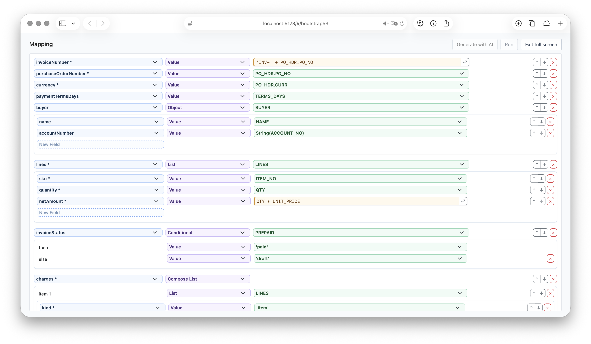

# React JSON Mapping Editor

## Overview

`morphos/react` is a lightweight, customizable React JSON mapping editor for building the mapping specifications used
by Morphos. Users edit mappings visually, while the application receives the same plain JSON object that the mapping
runtime can validate, store, version, and execute.

The editor provides mapping behavior without forcing a particular layout or design system:

- destination JSON Schemas provide field choices, required markers, and type-aware mapping controls;
- source JSON Schemas provide matching field and expression suggestions;
- plain HTML defaults work without a CSS framework;
- every row, input, action, and nested section can be replaced through the `components` prop;
- optional Bootstrap 3.4 and 5.3 component sets can be mixed with application-owned components.

[](https://morphosjs.org/playground/#/bootstrap53)

Try the mapping editor in the [interactive playground](https://morphosjs.org/playground/#/bootstrap53).

## Installation

React is an optional peer dependency of `morphos`:

```bash
npm install morphos react react-dom
```

Importing `morphos/react` does not require Bootstrap or another UI framework.

## Quick Start

```tsx
import { useState } from 'react';
import { MappingEditor } from 'morphos/react';
import type { RootMapping } from 'morphos';

const initialMapping: RootMapping = {
	code: 'UPC.substring(0, 5)',
	quantity: 'QTY',
	lineItems: {
		forEach: 'LINE_ITEMS',
		map: {
			id: 'ID',
			quantity: 'QTY'
		}
	}
};

function ProductMappingEditor() {
	const [mapping, setMapping] = useState<RootMapping>(initialMapping);

	return <MappingEditor value={mapping} onChange={setMapping} />;
}
```

`onChange` receives the complete current mapping. Use that value for live previews, validation, persistence, or direct
execution through the main [`morphos`](https://morphosjs.org/) package.

For an uncontrolled editor, pass `defaultValue` instead. The current mapping remains available through the editor ref.

## Schema-Guided Editing

Schemas are optional. Without them, the editor uses free-form destination keys and JavaScript expression inputs. Add
schemas when users benefit from guided choices.

### Destination Schema

Pass `schema` to list destination fields, infer an appropriate mapping kind, and mark required fields.

```tsx
const destinationSchema = {
	type: 'object',
	required: ['code', 'amount'],
	properties: {
		code: { type: 'string' },
		amount: { type: 'number' },
		lineItems: {
			type: 'array',
			items: {
				type: 'object',
				properties: {
					id: { type: 'string' }
				}
			}
		}
	}
};

<MappingEditor schema={destinationSchema} />
```

Schema fields render as dropdown options. Keys outside the schema remain available through `Other...`, so schemas can
guide users without preventing custom output. An empty mapping level also offers `Current value`, which writes the
wildcard key `'*'` and maps the current object or list item instead of a named field.

### Source Schema

Pass `sourceSchema` to suggest valid source paths for values, `forEach`, `from`, and `when` expressions.

```tsx
<MappingEditor
	schema={destinationSchema}
	sourceSchema={sourceSchema}
	value={mapping}
	onChange={setMapping}
/>
```

Suggestions are context-aware:

- field values suggest scalar paths, with likely name matches sorted first;
- `forEach` suggests arrays and scopes nested suggestions to each array item;
- `from` suggests objects and scopes nested suggestions to that object;
- `when` suggests scalar values suitable for conditions;
- list mappings expose `$index`, `$record`, and `$collection`;
- `All nested fields` writes `'*'` to copy the current object's fields.

Every suggestion control includes a JavaScript-expression option for mappings that need more than a schema path.

The companion [React JSON Schema Editor](https://morphosjs.org/react-schema-editor/) can create and maintain these
schemas in the same application.

## Customize the Layout

Morphos keeps mapping state and behavior separate from presentation. Component slots receive ready-to-render controls
and nested editor content; your components decide their placement.

For example, replace inline nested object and list editors with your application's dialog components:

```tsx
import type { SectionProps } from 'morphos/react';
import { Dialog, DialogContent, DialogTrigger } from './ui/Dialog';

function MappingSectionDialog({ header, body }: SectionProps) {
	return (
		<Dialog>
			<DialogTrigger>Edit nested mapping</DialogTrigger>
			<DialogContent>
				{header}
				{body}
			</DialogContent>
		</Dialog>
	);
}

const components = { Section: MappingSectionDialog };

<MappingEditor
	value={mapping}
	onChange={setMapping}
	components={components}
/>
```

The editor still owns expression changes, nested mapping state, additions, removals, and reordering. The injected
component only changes how that editor is presented. The same approach supports drawers, popovers, tabs, compact table
rows, or a complete application design system.

### Replace Individual Controls

Built-in defaults render plain HTML with `dm-mapping-*` class hooks. Style those classes directly or replace one slot:

```tsx
import { MappingEditor, type KeyInputProps } from 'morphos/react';

const KeyInput = ({ value, onChange, placeholder }: KeyInputProps) => (
	<input
		className="app-input"
		value={value}
		onChange={event => onChange(event.target.value)}
		placeholder={placeholder}
	/>
);

const components = { KeyInput };

<MappingEditor components={components} />
```

### Bootstrap Component Sets

Bootstrap integrations only emit classes; the corresponding Bootstrap CSS remains under your application's control.

```tsx
import bootstrap34 from 'morphos/react/bootstrap34';
import bootstrap53 from 'morphos/react/bootstrap53';

<MappingEditor components={bootstrap53} />
```

Individual themed components are exported when you want to combine them with custom slots:

```tsx
import { Row, SuggestedValueInput } from 'morphos/react/bootstrap53';
```

To extend the plain HTML component set, spread `defaultComponents`:

```tsx
import { defaultComponents, MappingEditor } from 'morphos/react';

const components = {
	...defaultComponents,
	Section: MappingSectionDialog
};

<MappingEditor components={components} />
```

## API

| Prop | Type | Description |
| --- | --- | --- |
| `value` | `RootMapping` | Controlled mapping value. |
| `defaultValue` | `RootMapping` | Uncontrolled initial value, used once on mount. |
| `onChange` | `(next: RootMapping) => void` | Receives the complete mapping after each edit. |
| `schema` | `JsonSchema` | Destination schema for field choices, required markers, and type inference. |
| `sourceSchema` | `JsonSchema` | Source schema for expression, `forEach`, `from`, and `when` suggestions. |
| `components` | `Partial<MappingEditorComponents>` | Replaces any built-in UI slot. |
| `labels` | `Partial<MappingEditorLabels>` | Replaces any user-visible label. |

The component exposes this ref handle:

```ts
interface MappingEditorHandle {
	readonly value: RootMapping;
}
```

## Component Slots

| Component | Purpose |
| --- | --- |
| `Container` | Wraps rows at the current mapping level. |
| `Row` | Places a value-mapping row and its controls. |
| `SectionRow` | Places an object, list, conditional, concat, or tuple row and its nested section. |
| `KeyInput` | Edits a free-form destination key. |
| `KeyLabel` | Displays a destination key bound to a schema field. |
| `SuggestedKeyInput` | Selects a destination schema field or switches to a custom key. |
| `ValueInput` | Edits a free-form JavaScript expression. |
| `SuggestedValueInput` | Selects a source path or switches to a JavaScript expression. |
| `TypeSelector` | Selects Value, List, Object, Conditional, Compose List, or Fixed List. |
| `Section` | Places a nested mapping's optional header and body. |
| `SectionHeader` | Places `forEach`, `from`, or `when` controls. |
| `Reorder` | Moves a row within its mapping level. |
| `RemoveButton` | Removes a row. |
| `AddElseButton` | Adds a conditional fallback branch. |
| `AddItemButton` | Adds an item to a composed list. |
| `InputResetButton` | Returns a custom key or expression to schema suggestions. |
| `SchemaAddBar` | Legacy schema-field selector retained for compatibility. |

Override `Section` to change nested navigation, `SectionRow` to redesign complete structured rows, or the smaller input
and action slots for incremental integration.

## Localization

Every visible string comes from `MappingEditorLabels`. Override any subset; omitted values use the defaults.

```tsx
const labels = {
	field: 'Field',
	array: 'List',
	object: 'Object',
	advanced: 'JavaScript expression...',
	newField: 'New destination field'
};

<MappingEditor labels={labels} />
```

Import `defaultLabels` to build a complete locale, and use `LabelsContext` inside custom components that need the active
labels.

```tsx
import { useContext } from 'react';
import { LabelsContext, type AddItemButtonProps } from 'morphos/react';

const AddItemButton = ({ onClick }: AddItemButtonProps) => {
	const labels = useContext(LabelsContext);
	return <button onClick={onClick}>{labels.addItem}</button>;
};
```

## Limitations

- Root-level tuple-form `PropertiesMap` (`ValueMap[]`) inputs are currently ignored on load.
- Schema interpretation focuses on `type`, `properties`, `items`, `required`, `title`, and `description`; it does not
  resolve `$ref`, `oneOf`, or `additionalProperties`.

## Related

- Use [`morphos/react-schema-editor`](https://morphosjs.org/react-schema-editor/) to create source and destination JSON
  Schemas.
- Use the main [`morphos`](https://morphosjs.org/) package to validate and execute mappings created by the editor.
